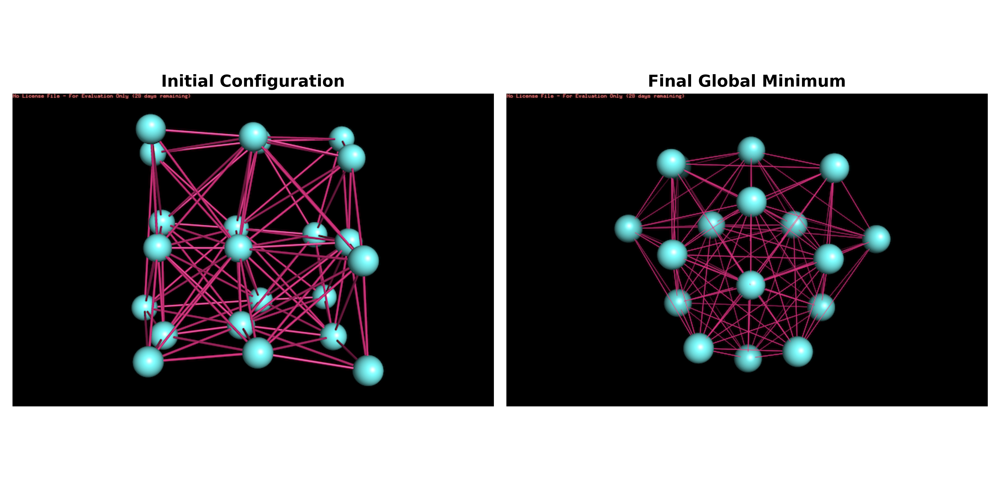

# HPC implementation of a revisited DE global optimization for atomic LJ Cluster


An efficient, parallel solver written in C++ and OpenMP for the global optimization of atomic clusters using a custom Differential Evolution algorithm. 

This project focuses on achieving the best trade-off between solution quality and execution time for NP-hard structural problems.

You can get a full explanation of this work by consulting the Jupyter notebook `Report.ipynb`.

## Table of Contents
1. [A Success Case: The LJ22 Global Minimum](#a-success-case-the-lj22-global-minimum)
2. [About The Project](#about-the-project)
3. [Configuration & Hyperparameters](#configuration--hyperparameters)
4. [Getting Started](#getting-started)
   - [Prerequisites](#prerequisites)
   - [Building the Project](#building-the-project)
5. [Usage](#usage)
6. [Key Features](#key-features)
7. [Results](#results)
8. [License](#license)

## A Success Case: The LJ22 Global Minimum

To demonstrate the solver's capability, a complete optimization run for the LJ22 cluster is presented. This is the largest cluster for which the algorithm consistently found the **exact global minimum (0.00% error)**.

The figure below shows the transition from a semi-ordered, high-energy initial configuration to the final, perfectly symmetric, low-energy structure.



This visual result highlights the solver's ability to navigate the complex energy landscape and converge to the correct, highly ordered geometric structure.

## About The Project
This project tackles the geometric optimization of atomic clusters, a classic NP-hard problem in computational physics. The goal is to find the arrangement of N atoms that minimizes the potential energy, described by potentials such as Lennard-Jones.

The core of this work is a custom-developed `jDE-like` [**Differential Evolution**](https://link.springer.com/article/10.1023/A:1008202821328) solver. A key feature is its "stagnation and reset" mechanism, which acts as an implicit Basin-Hopping strategy, proving highly effective at escaping the deceptive local minima that characterize these energy landscapes.

The implementation is heavily optimized for performance, leveraging C++ and OpenMP to create a high-performance computing tool capable of solving complex clusters in minutes, a task that would require hours with standard high-level libraries.

## Configuration & Hyperparameters
The key parameters of the solver are listed below.

| Parameter             | Value                     | Description                               |
| --------------------- | ------------------------- | ----------------------------------------- |
| `NP` (**Population Size)**             | 160 for $N <=20$, 250 for $N > 20$| Controls the search diversity. Increased for larger problems to ensure adequate exploration of the vast solution space.    |
| `generations`              | 20000                         | Upper limit for the run. The algorithm almost always terminates earlier due to an **early stopping** mechanism that detects stagnation. |
| `CR` (Crossover Rate)          | 0.9                         | Crossover probability. A high value (near 1.0) promotes exploration by preserving the integrity of new solutions generated by mutation.|
| `F`             | Adaptive, initialized in $[0.3, 1.0]$                  | Mutation factor. It is adapted dynamically (jDE-style): the algorithm "learns" and reuses F values that lead to success.          |
| `reinitialization_stall_trigger`          | 150 for $N <=20$, 100 for $N > 20$ | Number of stalled generations to trigger a reset. Lowered for larger problems to make the algorithm more reactive in escaping local minima.        |
| `reinitialization_fraction` | 0.25 for $N <=20$, 0.20 for $N > 20$  | Fraction of the population to reset. Lowered for larger problems to make the "brutal jump" less disruptive, preserving more information.             |
| `D`       | 1.6 for $N <=20$, 1.2 for $N > 20$ | Step D on the cluster initialization.  |

## Getting Started
Follow these steps to build and run the project locally.

### Prerequisites
* A C++ compiler with **OpenMP support** (e.g., GCC, or LLVM/Clang from Homebrew on macOS).
* **CMake** (version 3.20 or higher).

**Note for macOS users**: Apple's default Clang does not support OpenMP. You must install a compatible compiler via [Homebrew](https://brew.sh):
```bash
brew install llvm
# or
brew install gcc
```


### Building the project
1.  **Clone the repository:**
    ```bash
    git clone https://github.com/marcolacagnina/hpc-cluster-optimizer.git
    cd hpc-cluster-optimizer/
    ```

2.  **Configure and build with CMake:**
    ```bash
    mkdir build
    cd build
    CC=gcc-15 CXX=g++-15 cmake .. -D CMAKE_BUILD_TYPE=Release
    make
    ```


The executable `LJOptimizer` is created in the `build/` directory.


### Usage
To run the solver, navigate to the build directory and execute the program. 
It is crucial to specify the number of threads via the `OMP_NUM_THREADS` environment variable.

```bash
OMP_NUM_THREADS=8 ./LJOptimizer
```

The output will be a `.xyz` file corresponding to the best configuration of atoms found, named `best_cluster.xyz`. You can find it in the main project directory.
This file contains the coordinates of the best-found atomic configuration. 
It is suggested to view the output file with software like `VMD` or `PyMOL`.

### Key Features
* **Custom DE Algorithm**: A jDE-like solver with a powerful "stagnation and reset" mechanism to escape local minima.
* **Multi-threading with OpenMP**: Parallelizes initialization, the main evolutionary loop, and the reset mechanism.
* **Cache-Friendly Memory Layout**: Uses "flat" data structures to maximize cache locality.
* **Zero-Copy Updates**: Employs std::swap for near-instantaneous population updates.
* **SIMD Vectorization**: The energy function is optimized with #pragma omp simd.

 
### Results
The solver was benchmarked on Lennard-Jones clusters up to N=52. It consistently finds high-quality solutions (error < 4.5%) and demonstrates a speedup of >150x compared to the standard, parallel implementation of Differential Evolution in Python/SciPy.

### License
Distributed under the MIT License. See `LICENSE` file for more information.

